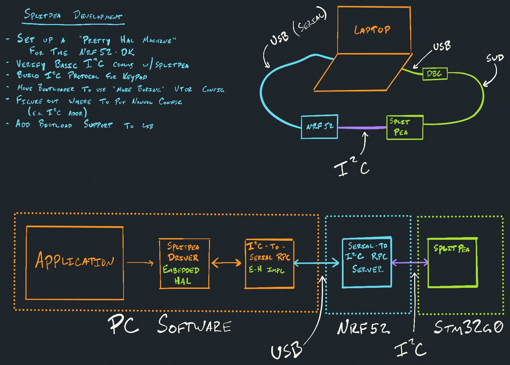

# Pretty HAL machine

More info soon! For now you can watch the stream where I wrote the
USB-to-I2C adapter for the splitpea software [on youtube!](https://www.youtube.com/watch?v=2S6G7wd8Kpo).

The goal of this project is to make a "PC to any protocol adapter" using cheap, off the shelf microcontrollers.

